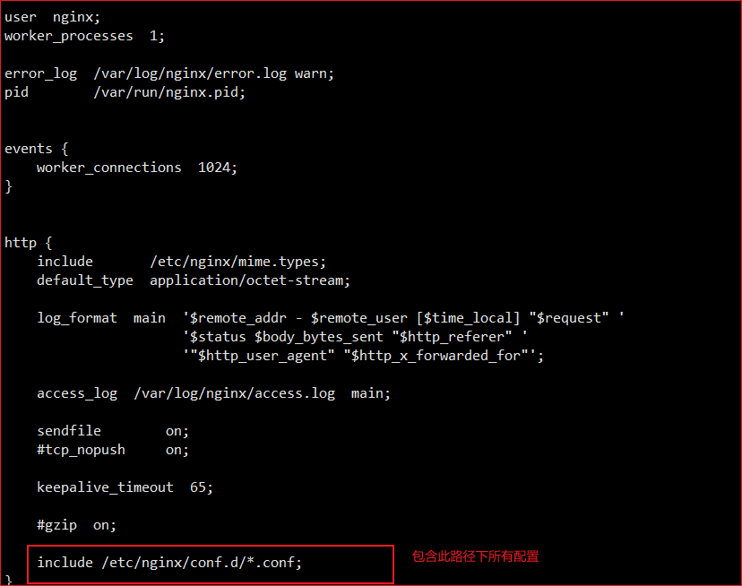

# docker 安装
## 卸载旧版本
```
yum remove docker \
                  docker-client \
                  docker-client-latest \
                  docker-common \
                  docker-latest \
                  docker-latest-logrotate \
                  docker-logrotate \
                  docker-engine
```
## 设置docker仓库
```
yum install -y yum-utils

yum-config-manager \
    --add-repo \
    https://download.docker.com/linux/centos/docker-ce.repo
```

## 安装docker引擎
```
yum install docker-ce docker-ce-cli containerd.io
```
## 启动docker
```
yum install docker-ce docker-ce-cli containerd.io
```
## 查看docker版本
```
docker -v
```
## 查看docker镜像
```
docker images
```
## 设置docke开机自启
```
systemctl enable docker
```
## 配置阿里云镜像加速
```
mkdir -p /etc/docker
tee /etc/docker/daemon.json <<-'EOF'
{
  "registry-mirrors": ["https://kj0ydtqf.mirror.aliyuncs.com"]
}
EOF
systemctl daemon-reload
systemctl restart docker
```
# 配置服务器环境
## 安装mysql
```
docker pull mysql:5.7
```
## 启动mysql
```
docker run -p 3306:3306 --name mysql \
-v /mydata/mysql/log:/var/log/mysql \
-v /mydata/mysql/data:/var/lib/mysql \
-v /mydata/mysql/conf:/etc/mysql \
-e MYSQL_ROOT_PASSWORD=root \
-d mysql:5.7
```
参数说明:
 -p 3306:3306: 将容器的3306端口映射到主机的3306端口
 -v /mydata/mysql/log:/var/log/mysql：将日志文件夹挂载到主机
 -v /mydata/mysql/data:/var/lib/mysql：将数据文档文件夹挂载到主机
 -v /mydata/mysql/conf:/etc/mysql：将配置文件夹挂载到主机
 -e MYSQL_ROOT_PASSWORD=root： 初始化root用户的密码
 ## 设置启动docker时，即运行mysql
 docker update mysql --restart=always
 ## 配置mysql编码
 vi /mydata/mysql/conf/my.conf 重启mysql
 ```
 [client]
default-character-set=utf8
[mysql]
default-character-set=utf8
[mysqld]
init_connect='SET collation_connection = utf8_unicode_ci'
init_connect='SET NAMES utf8'
character-set-server=uf8
collation-server=utf8_unicode_ci
skip-character-set-client-handshake
skip-name-resolve
```

 ## 进入mysql控制台
```
docker exec -it mysql /bin/bash
```
 ## 安装redis
 ```
 docker pull redis
 ```
 ## 启动redis
 ```
 docker run -p 6379:6379 --name redis 
 -v /mydata/redis/data:/data 
 -v /mydata/redis/redis.conf:/etc/redis/redis.conf 
 -d redis redis-server /etc/redis/redis.conf
 ```

## 连接redis
```
docker exec -it redis redis-cli
```

## 配置redis持久化
aof方式：vi redis.conf
```
appendonly yes
```

## 安装elasticsearch、kibana
注意版本一致
```
docker pull elasticsearch:7.4.2
docker pull kibana:7.4.2
```
## 准备es环境
```
 mkdir -p /mydata/elasticsearch/config
 mkdir -p /mydata/elasticsearch/data
 echo "http.host: 0.0.0.0" >> /mydata/elasticsearch/config/elasticsearch.yml
```
## 启动es
```
docker run --name elasticsearch \ 
-p 9200:9200 \ http请求端口
-p 9300:9300 \ es在分布式集群状态下节点之间的通信端口
-e "discovery.type=single-node" \ 单节点模式
-e ES_JAVA_OPTS="-Xms64m -Xmx128m" \ 指定es初始化内存64m，最大128m
-v /mydata/elasticsearch/config/elasticsearch.yml:/usr/share/elasticsearch/config/elasticsearch.yml \
-v /mydata/elasticsearch/data:/usr/share/elasticsearch/data \
-v /mydata/elasticsearch/plugins:/usr/share/elasticsearch/plugins \
-d elasticsearch:7.4.2
```
chmod -R 777 /mydata/elasticsearch/ 保证权限
###配置es分词器
ik分词器：https://github.com/medcl/elasticsearch-analysis-ik
下载与es版本相同的ik分词器，解压放置于/mydata/elasticsearch/plugins/ik/目录下
在ik/config/ 下编辑IKAnalyzer.cfg.xml 配置远程字典


## 启动kibana
```
 docker run --name kibana -e ELASTICSEARCH_HOSTS=http://115.29.195.125:9200 -p 5601:5601 -d kibana:7.4.2
```

## 安装nginx
```
docker run -p 80:80 --name nginx \
-v /mydata/nginx/html:/usr/share/nginx/html \
-v /mydata/nginx/logs:/var/log/nginx \
-v /mydata/nginx/conf:/etc/nginx \
-d nginx:1.10
```
###nginx配置反向代理
####nginx配置文件位置：/etc/nginx（/mydata/nginx） 下的nginx.conf


####conf.d/下的default.conf

####自定义配置
1) 首先在nginx.conf中配置上流服务器地址

2) 其次在自定义的conf中配置代理

3) nginx代理给网关时，会丢失请求的信息
   

##安装nacos
在/mydata/nacos/init.d/ 目录下创建custom.properties文件
```shell
docker run --name nacos --restart=always 
-e MODE=standalone \
-e JVM_XMS=128m \
-e JVM_XMX=128m \
-v /mydata/nacos/logs:/home/nacos/logs \
-v /mydata/nacos/init.d/custom.properties:/home/nacos/init.d/custom.properties \
-p 8848:8848 -d nacos/nacos-server
```
